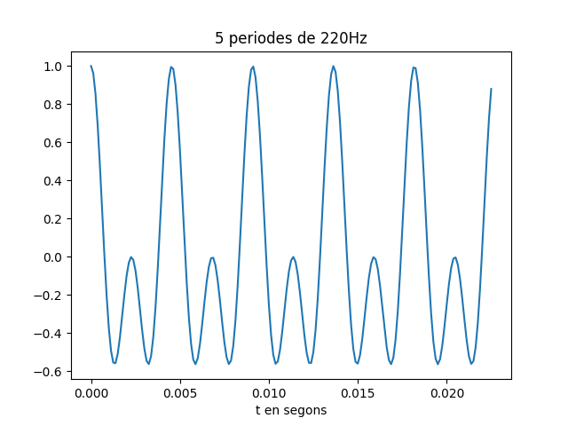
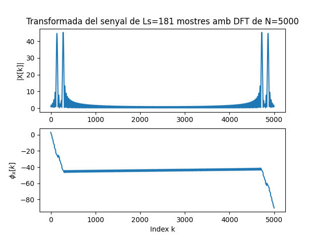
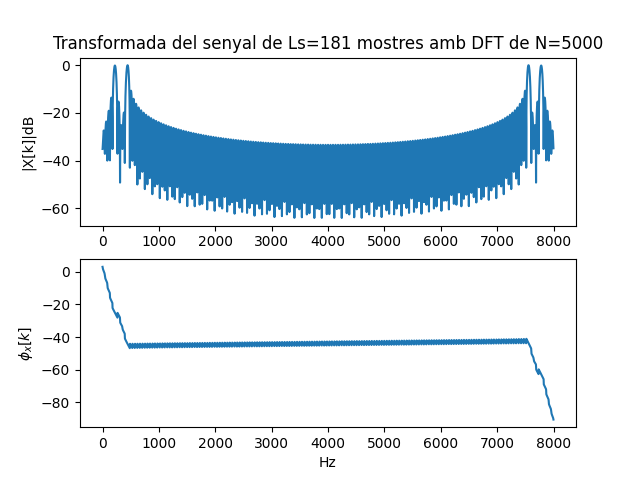
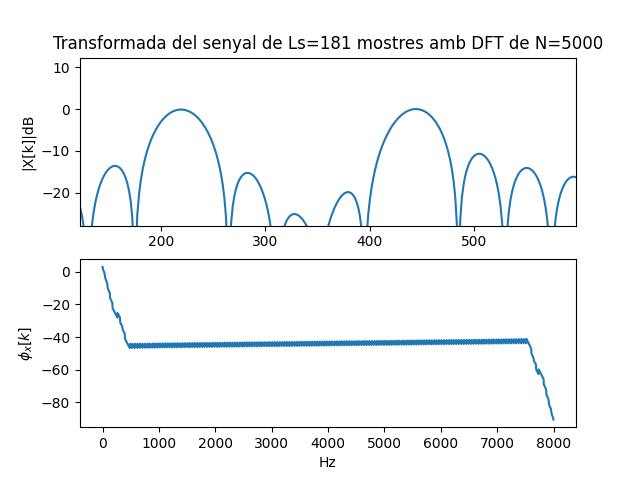
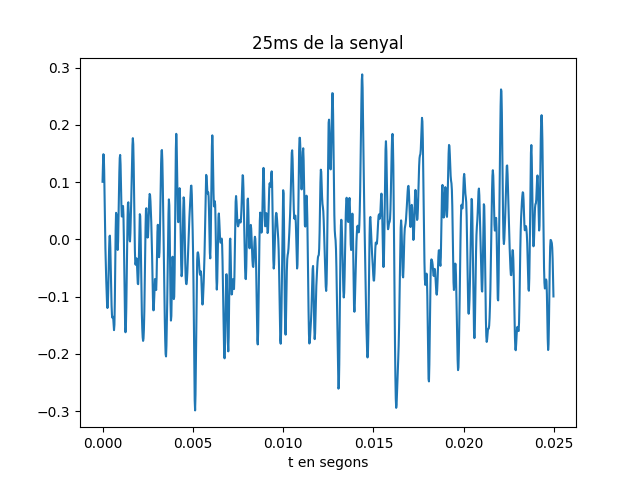
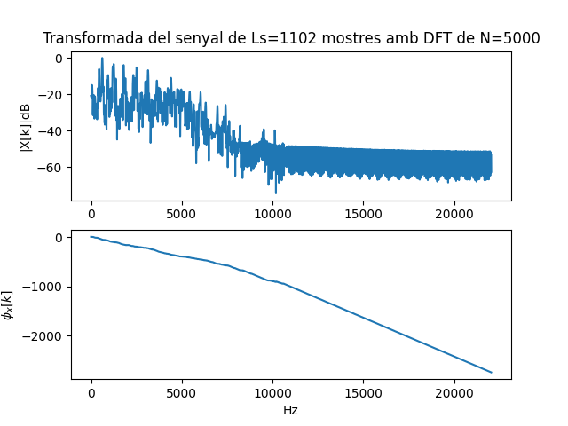
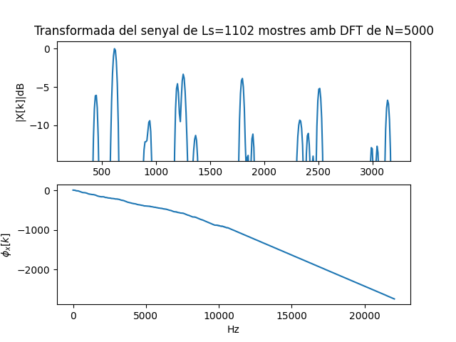

Primera tasca APA 2023: Anàlisi fitxer de so
============================================

## Nom i cognoms: Alexandr Ramos


## Representació temporal i freqüencial de senyals d'àudio.

### Domini temporal

Per llegir, escriure i representar un fitxer en format `*.wav` en python podem fem servir els següents mòduls:

- Numpy:
```python
import numpy as np
```
- Matplotlib: 
```python
import matplotlib.pyplot as plt
```
- Soundfile:
```python
import soundfile as sf
```

Per **crear** i **guardar** a un fitxer un senyal sinusoidal de freqüència `fx Hz`, digitalitzat a `fm Hz`, de durada `T` segons i amplitud 
`A` fem:

```python
T= 2.5                               # Durada de T segons
fm=8000                              # Freqüència de mostratge en Hz
fx=440                               # Freqüència de la sinusoide
A=4                                  # Amplitud de la sinusoide
pi=np.pi                             # Valor del número pi
L = int(fm * T)                      # Nombre de mostres del senyal digital
Tm=1/fm                              # Període de mostratge
t=Tm*np.arange(L)                    # Vector amb els valors de la variable temporal, de 0 a T
x = A * np.cos(2 * pi * fx * t)      # Senyal sinusoidal
sf.write('so_exemple1.wav', x, fm)   # Escriptura del senyal a un fitxer en format wav
```

El resultat és un fitxer guardat al directori de treball i que es pot reproduir amb qualsevol reproductor d'àudio

Per **representar** gràficament 5 períodes de senyal fem:

```python
Tx=1/fx                                   # Període del senyal
Ls=int(fm*5*Tx)                           # Nombre de mostres corresponents a 5 períodes de la sinusoide

plt.figure(0)                             # Nova figura
plt.plot(t[0:Ls], x[0:Ls])                # Representació del senyal en funció del temps
plt.xlabel('t en segons')                 # Etiqueta eix temporal
plt.title('5 periodes de la sinusoide')   # Títol del gràfic
plt.show()                                # Visualització de l'objecte gràfic. 
```

El resultat del gràfic és:


> Nota: Si es treballa amb ipython, es pot escriure %matplotlib i no cal posar el plt.show() per veure gràfics

El senyal es pot **escoltar (reproduir)** directament des de python important un entorn de treball amb els dispositius de so, com per 
exemple `sounddevice`:

```python
import sounddevice as sd      # Importem el mòdul sounddevice per accedir a la tarja de so
sd.play(x, fm)                # Reproducció d'àudio
```

### Domini transformat

Domini transformat. Els senyals es poden analitzar en freqüència fent servir la Transformada Discreta de Fourier. 

La funció que incorpora el paquet `numpy` al submòdul `fft` és `fft`:

```python
from numpy.fft import fft     # Importem la funció fft
N=5000                        # Dimensió de la transformada discreta
X=fft(x[0 : Ls], N)           # Càlcul de la transformada de 5 períodes de la sinusoide
```

I podem representar el mòdul i la fase, en funció de la posició de cada valor amb:

```python
k=np.arange(N)                        # Vector amb els valors 0≤  k<N

plt.figure(1)                         # Nova figura
plt.subplot(211)                      # Espai per representar el mòdul
plt.plot(k,abs(X))                    # Representació del mòdul de la transformada
plt.title(f'Transformada del senyal de Ls={Ls} mostres amb DFT de N={N}')   # Etiqueta del títol
plt.ylabel('|X[k]|')                  # Etiqueta de mòdul
plt.subplot(212)                      # Espai per representar la fase
plt.plot(k,np.unwrap(np.angle(X)))    # Representació de la fase de la transformad, desenroscada
plt.xlabel('Index k')                 # Etiqueta de l'eix d'abscisses 
plt.ylabel('$\phi_x[k]$')             # Etiqueta de la fase en Latex
plt.show()                            # Per mostrar els grafics
```


Proves i exercicis a fer i entregar
-----------------------------------

1. Reprodueix l'exemple fent servir diferents freqüències per la sinusoide. Al menys considera $f_x = 4$ kHz, a banda d'una
    freqüència pròpia en el marge audible. Comenta els resultats.

```python
# Importem tots els moduls necessaris

import numpy as np
import matplotlib.pyplot as plt
import soundfile as sf
import sounddevice as sd
from numpy.fft import fft

# Gnenerem la senyal
T= 2.5                               # Durada de T segons
fm=8000                              # Freqüència de mostratge en Hz
fx1=440                              # Freqüència de la sinusoide 1
fx2=4000                             # Freqüència de la sinusoide 2
fx3=220                              # Freqüència de la sinusoide 3
A=0.5                                # Amplitud de les sinusoide
pi=np.pi                             # Valor del número pi
L = int(fm * T)                      # Nombre de mostres del senyal digital
Tm=1/fm                              # Període de mostratge
t=Tm*np.arange(L)                    # Vector amb els valors de la variable temporal, de 0 a T
x = A * ( np.cos(2*pi*fx1*t) + np.sin(2*pi*fx2*t) + np.cos(2*pi*fx3*t) ) # Creo la senyal i la gruardo    
sf.write('so_sinusoides.wav', x, fm)

# Representem la senyal
Tx=1/fx3                                  # Període del senyal de mes baixa frequencia
Ls=int(fm*5*Tx)                           # Nombre de mostres corresponents a 5 períodes de la sinusoide de major amplitud 'fx3'

plt.figure(0)                             # Nova figura
plt.plot(t[0:Ls], x[0:Ls])                # Representació del senyal en funció del temps
plt.xlabel('t en segons')                 # Etiqueta eix temporal
plt.title('5 periodes de 220Hz')          # Títol del gràfic
plt.show()                                # Visualització de l'objecte gràfic.
```


```python
# Escoltem la senyal
sd.play(x, fm)

# Generem la transformada
N=5000                        # Dimensió de la transformada discreta
X=fft(x[0 : Ls], N)           # Càlcul de la transformada de 5 períodes de la sinusoide

# Mostrem la transformada
k=np.arange(N)                        # Vector amb els valors 0 ≤ k < N

plt.figure(1)                         # Nova figura
plt.subplot(211)                      # Espai per representar el mòdul
plt.plot(k,abs(X))                    # Representació del mòdul de la transformada
plt.title(f'Transformada del senyal de Ls={Ls} mostres amb DFT de N={N}')   # Etiqueta del títol
plt.ylabel('|X[k]|')                  # Etiqueta de mòdul
plt.subplot(212)                      # Espai per representar la fase
plt.plot(k,np.unwrap(np.angle(X)))    # Representació de la fase de la transformad, desenroscada
plt.xlabel('Index k')                 # Etiqueta de l'eix d'abscisses 
plt.ylabel('$\phi_x[k]$')             # Etiqueta de la fase en Latex
plt.show()                            # Per mostrar els grafics
```


- Observem que la frequencia de 4000 Hz no apareix per enlloc, tot i haver sigut generada. Aixo es degut a la coincidencia de fx2=1/2*fm i que fx2 ha sigut generada amb la funció sin sense fase, provocant que totes les mostres d'aquesta sin es mostregin amb valor 0. Fenomen de Nyquist-Shannon.


2. Modifica el programa per considerar com a senyal a analitzar el senyal del fitxer wav que has creat 

    (`x_r, fm = sf.read('nom_fitxer.wav')`).

```python
# Importem tots els moduls necessaris

import numpy as np
import matplotlib.pyplot as plt
import soundfile as sf
import sounddevice as sd
from numpy.fft import fft

# Llegim la senyal
x, fm = sf.read('so_sinusoides.wav')

L = int(len(x))                      # Nombre de mostres del senyal digital
Tm=1/fm                              # Període de mostratge
t=Tm*np.arange(L)                    # Vector amb els valors de la variable temporal, de 0 a T

# Representem la senyal
Tx=1/220                                  # Període del senyal de mes baixa frequencia
Ls=int(fm*5*Tx)                           # Nombre de mostres corresponents a 5 períodes de la sinusoide de major amplitud '220Hz'

plt.figure(2)                             # Nova figura
plt.plot(t[0:Ls], x[0:Ls])                # Representació del senyal en funció del temps
plt.xlabel('t en segons')                 # Etiqueta eix temporal
plt.title('5 periodes de 220Hz')          # Títol del gràfic
plt.show()                                # Visualització de l'objecte gràfic.

# Escoltem la senyal
sd.play(x, fm)

# Generem la transformada
N=5000                        # Dimensió de la transformada discreta
X=fft(x[0 : Ls], N)           # Càlcul de la transformada de 5 períodes de la sinusoide

# Mostrem la transformada
k=np.arange(N)                        # Vector amb els valors 0 ≤ k < N

plt.figure(3)                         # Nova figura
plt.subplot(211)                      # Espai per representar el mòdul
plt.plot(k,abs(X))                    # Representació del mòdul de la transformada
plt.title(f'Transformada del senyal de Ls={Ls} mostres amb DFT de N={N}')   # Etiqueta del títol
plt.ylabel('|X[k]|')                  # Etiqueta de mòdul
plt.subplot(212)                      # Espai per representar la fase
plt.plot(k,np.unwrap(np.angle(X)))    # Representació de la fase de la transformad, desenroscada
plt.xlabel('Index k')                 # Etiqueta de l'eix d'abscisses 
plt.ylabel('$\phi_x[k]$')             # Etiqueta de la fase en Latex
plt.show()                            # Per mostrar els grafics
```

- Insereix a continuació una gràfica que mostri 5 períodes del senyal i la seva transformada.




- Explica el resultat del apartat anterior.

    - Obtenim exactament els mateixos resulatat, tot i que hem necessitat coneixer la frequencia de la sinusoide de menor frequencia per poder determinar els 5 periodes a analitzar. Es pot fer amb un altre valor trobat de forma empirica, pero en aquest cas hem aprofitat que conixem el valor

    - PD: Pot semblar que al reaprofitar la *x* com a variable, els resultats siguin els mateixos per utilitzar la variable anterior. Entre exercicis torno a executar el python desde zero per asegurar-me de comensar en entorn net.


3. Modifica el programa per representar el mòdul de la Transformada de Fourier en dB i l'eix d'abscisses en el marge de
    $0$ a $f_m/2$ en Hz.

```python
# Importem tots els moduls necessaris

import numpy as np
import matplotlib.pyplot as plt
import soundfile as sf
import sounddevice as sd
from numpy.fft import fft

# Llegim la senyal
x, fm = sf.read('so_sinusoides.wav')

L = int(len(x))                      # Nombre de mostres del senyal digital
Tm=1/fm                              # Període de mostratge
t=Tm*np.arange(L)                    # Vector amb els valors de la variable temporal, de 0 a T

# No hi ha necessetitat de rpresentar ni escoltar la Senyal, es el mateix proces que l'apartat anterior
Tx=1/220                                  # Període del senyal de mes baixa frequencia
Ls=int(fm*5*Tx)                           # Nombre de mostres corresponents a 5 períodes de la sinusoide de major amplitud '220Hz'

# Generem la transformada
N=5000                        # Dimensió de la transformada discreta
X=fft(x[0 : Ls], N)           # Càlcul de la transformada de 5 períodes de la sinusoide

# Fem cambis d'escala
Xmax=float(max(abs(X)))       # Busquem valor maxim del modul de la transformada
Xabs=20*np.log10((abs(X)/Xmax))  # Generem modul en dB de la transformada

k=np.arange(N)                        # Vector amb els valors 0 ≤ k < N
freq=(k/N)*fm

# Mostrem la transformada
plt.figure(4)                         # Nova figura
plt.subplot(211)                      # Espai per representar el mòdul
plt.plot(freq,Xabs)                    # Representació del mòdul de la transformada
plt.title(f'Transformada del senyal de Ls={Ls} mostres amb DFT de N={N}')   # Etiqueta del títol
plt.ylabel('|X[k]|dB')                  # Etiqueta de mòdul
plt.subplot(212)                      # Espai per representar la fase
plt.plot(freq,np.unwrap(np.angle(X)))    # Representació de la fase de la transformad, desenroscada
plt.xlabel('Hz')                 # Etiqueta de l'eix d'abscisses 
plt.ylabel('$\phi_x[k]$')             # Etiqueta de la fase en Latex
plt.show()                            # Per mostrar els grafics
```

- Comprova que la mesura de freqüència es correspon amb la freqüència de la sinusoide que has fet servir.




        - Veiem que tot quadre amb els 220Hz i 440 Hz

- Com pots identificar l'amplitud de la sinusoide a partir de la representació de la transformada?
Comprova-ho amb el senyal generat.
    - Observem que els 2 pics corresponen a les 2 sinusoides generades originalmen (sense tinder en compte la sinusoide de 4000Hz). La amplitud correspon al màxim valor que en dB correspon a 0dB. Aixo es aixi, perque hem adaptat l'escala de dB de forma que 0dB = MAX modul (X) i en aquest cas les dos sinusoides tenen la mateixa amplitud que corresponen al màxim.

> NOTES:
>
> - Per representar en dB has de fer servir la fórmula següent:
>
> $X_{dB}(f) = 20\log_{10}\left(\frac{\left|X(f)\right|}{\max(\left|X(f)\right|}\right)$
>
> - La relació entre els valors de l'índex k i la freqüència en Hz és:
>
> $f_k = \frac{k}{N} f_m$

4. Tria un fitxer d'àudio en format wav i mono (el pots aconseguir si en tens amb altres formats amb el programa Audacity). 
    Llegeix el fitxer d'àudio i comprova:

```python
# Importem tots els moduls necessaris

import numpy as np
import matplotlib.pyplot as plt
import soundfile as sf
import sounddevice as sd
from numpy.fft import fft

# Llegim la senyal
x, fm = sf.read('german-ambulance.wav')

# Agafem a partir del segon 6 fins el segon 8
dif_mostra = fm * 2         # calculem quantes mostres son 2 segons
init_mostra = fm * 6        # calculem la mostra inicial
fin_mostra = init_mostra + dif_mostra + 1  # Mostra post-final

x = x[init_mostra : fin_mostra : 1]  # reduim la senyal al que ens interesa
```

- Freqüència de mostratge.

```python
print('La freqüència de mostratge es de', fm, 'Hz')
```
    - La freqüència de mostratge es de 44100 Hz

- Nombre de mostres de senyal.

```python
print('La senyal te', len(x), 'mostres')
```
    - La senyal te 88201 mostres

- Tria un segment de senyal de 25ms i insereix una gráfica amb la seva evolució temporal.
```python
L = int(len(x))                      # Nombre de mostres del senyal digital
Tm=1/fm                              # Període de mostratge
t=Tm*np.arange(L)                    # Vector amb els valors de la variable temporal, de 0 a T

Ls=int(fm*0.025)                     # Mostres corresponents a 25ms

# Representació temporal
plt.figure(5)                             # Nova figura
plt.plot(t[0:Ls], x[0:Ls])                # Representació del senyal en funció del temps
plt.xlabel('t en segons')                 # Etiqueta eix temporal
plt.title('25ms de la senyal')            # Títol del gràfic
plt.show()                                # Visualització de l'objecte gràfic.
```


- Representa la seva transformada en dB en funció de la freqüència, en el marge $0\le f\le f_m/2$.

```python
N = 5000                      # Dimensio de la transformada discreta
X=fft(x[0 : Ls], N)           # Càlcul de la transformada

# Ens quedem amb la meitat de la transformada per tindre el segment 0 < f < fm/2
X = X[0 : int(N/2)]

# Fem cambis d'escala
Xmax=float(max(abs(X)))          # Busquem valor maxim del modul de la transformada
Xabs=20*np.log10((abs(X)/Xmax))  # Generem modul en dB de la transformada

k=np.arange(int(N/2))            # Vector amb els valors 0 ≤ k < N/2
freq=(k/N)*fm                    # Apliquem formula per pasar de k a Hz

# Mostrem la transformada
plt.figure(6)                         # Nova figura
plt.subplot(211)                      # Espai per representar el mòdul
plt.plot(freq,Xabs)                   # Representació del mòdul de la transformada
plt.title(f'Transformada del senyal de Ls={Ls} mostres amb DFT de N={N}')   # Etiqueta del títol
plt.ylabel('|X[k]|dB')                # Etiqueta de mòdul
plt.subplot(212)                      # Espai per representar la fase
plt.plot(freq,np.unwrap(np.angle(X))) # Representació de la fase de la transformad, desenroscada
plt.xlabel('Hz')                      # Etiqueta de l'eix d'abscisses 
plt.ylabel('$\phi_x[k]$')             # Etiqueta de la fase en Latex
plt.show()                            # Per mostrar els grafics 
```


- Quines son les freqüències més importants del segment triat?

    - Fent un zoom en la gràfica anterior, observem que les sinusoides amb major amplitud que conformen la senyal, son als 620 Hz aprox, i amb menor mesura, als 450 Hz, amb tot d'un seguit d'harmonics que s'estenen practicament fins els 9000Hz aprox.



Entrega
-------

- L'alumne ha de respondre a totes les qüestions formulades en aquest mateix fitxer, README.md.
    - El format del fitxer es l'anomenat *Markdown* que permet generar textos amb capacitats gràfiques (com ara *cursiva*, **negreta**,
      fòrmules matemàtiques, taules, etc.), sense perdre la llegibilitat en mode text.
    - Disposa d'una petita introducció a llenguatge de Markdown al fitxer `MARKDOWN.md`.
- El repositori GitHub ha d'incloure un fitxer amb tot el codi necesari per respondre les qüestions i dibuixar les gràfiques.
- El nom del fitxer o fitxers amb el codi ha de començar amb les inicials de l'alumne (per exemple, `fvp_codi.py`).
- Recordéu ficar el el vostre nom complet a l'inici del fitxer o fitxers amb el codi i d'emplar el camp `Nom i cognoms` a dalt de tot
  d'aquest fitxer, README.md.
